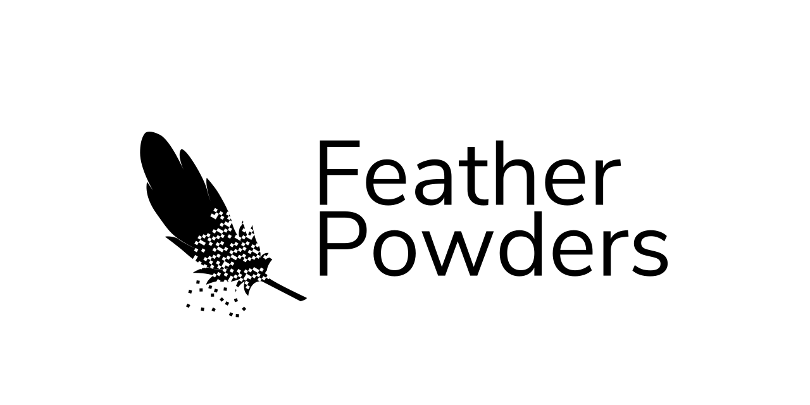

<p align="center">
    
</p>

# FeatherPowders
_API Plugin_

## Using FeatherPowders
As of today, you can only get FeatherPowders Maven Artifact by building it:

```console
$ mvn install
```

This will install FeatherPowders to your local Maven repository ``.m2``, as well as the plugin in ``target/``

To add FeatherPowders as depenency, simply add this in your ``pom.xml``:
```xml
<dependency>
    <groupId>xyz.studiomango</groupId>
    <artifactId>featherpowders</artifactId>
    <version>0.0.1-SNAPSHOT</version>
    <scope>provided</scope>
</dependency>
```

Don't forget to add ``FeatherPowders`` as depenency inside ``plugin.yml``:
```yaml
depend: [FeatherPowders]
# or
softdepend: [FeatherPowders]
```

## API Overview
FeatherPowders provides some API for you to use:
- Custom Items Driver API (``featherpowders.items.ItemsDriver``)
- Data Storage API and Data Storage Drivers (``featherpowders.data.DataDriver``)
- Binary Reader and Binary Writer (package ``featherpowders.binary``)
- Annotations Command API (``featherpowders.commands.Command``)
- User Interface API (``featherpowders.ui.PlayerUI``)